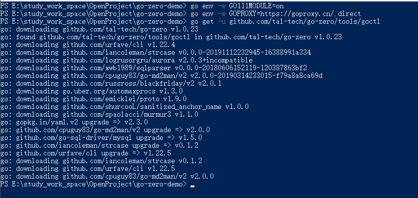

# go-zero项目启动

## 前言

刚刚了解完 [go-zero项目](https://gitee.com/kevwan/go-zero) 的 [架构设计](https://www.bilibili.com/video/BV1rD4y127PD/)，Kevin老师也讲的非常通俗易懂，能够很好的把一些理念和SpringCloud的思想对应起来，下面就开始正式学习一下go-zero项目了~

## 下载Go代码生成工具

配置代理，解决依赖下载困难的问题

```bash
go env -w GO111MODULE=on
go env -w GOPROXY=https://goproxy.cn/,direct
```

然后进行依赖的下载，主要是下载  goctl 用来生成我们的项目

```bash
go get -u github.com/tal-tech/go-zero/tools/goctl
```



## 快速生成api服务

安装好 goctl项目后，我们就可以开始自动生成 项目了

```bash
# 初始化项目  greet
 goctl api new greet
# 进入目录 
cd greet
# 读取配置文件运行项目
go run greet.go -f etc/greet-api.yaml
```

默认侦听在8888端口（可以在配置文件里修改），可以通过url请求：

http://localhost:8888/greet/from/you

如果有以下返回结果，表示项目运行成功~


## 编写业务代码

- api文件定义了服务对外暴露的路由，可参考[api规范](https://github.com/tal-tech/zero-doc/blob/main/doc/goctl.md)

- 可以在servicecontext.go里面传递依赖给logic，比如mysql, redis等
- 在api定义的get/post/put/delete等请求对应的logic里增加业务处理逻辑

## goctl用途

- 定义api请求
- 根据定义的api自动生成golang（后端），java（ios & android），typescript
- 生成MySQL CURD + Cache
- 生成MongoDB CURD + Cache

## goctl使用说明

### 快速生成服务

```bash
# 生成api服务（类似于单体应用）
api: goctl api new xxxx

# 生成rpc（类似于微服务）
rpc: goctl rpc new xxxx
```

### goctl参数说明

```bash
goctl api [go/java/ts] [-api user/user.api] [-dir ./src]
```

