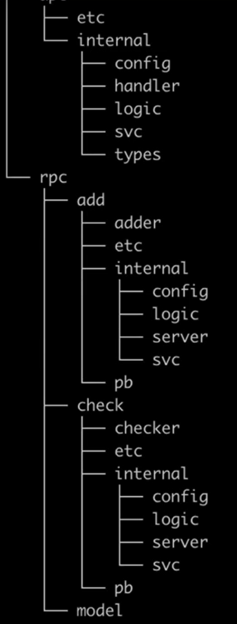

# go-zero适用场景

## go-zero适用场景

## go-zero的实际体验

自己定义api的文件格式，也使用过swagger-ui，但是没有自己定义的这么精简

go-zero中代码结构都是一致的，使用的效果非常不错

## go-zero发展

go-zero以后会发展平台化，将监控，服务注册，限流，分流，队列等平台sass化

同时会专门做一个 go-zero-admin的页面，用于快速构建后台管理项目

现在已经有 [gin-vue-admin](https://github.com/flipped-aurora/gin-vue-admin) 在做这一块了

## 微服务的项目结构，monorepo的CI/CD处理

项目结构图如下所示：

- etc：配置文件
- internal：内部文件
  - config：配置
  - handler：api定位时的路由
  - logic：api对应的逻辑
  - svc：context相关的
  - types：定义的请求和返回时的结构体

- rpc：主要用于远程过程调用时使用的
- 

CI/CD：持续集成，持续部署。使用了jenkins作为CI/CD工具，然后分为了测试的环境、预发布的环境、生产环境

灰度集群：晚上六点，进行灰度测试。如果到了第二天的十点，都没有故障，那么会自动同步到所有的集群。

## go-zero无感切换

打算换go-zero框架重构项目，如何做好线上业务稳定安全用户无感切换？

我们需要逐步上线，而不是一下改完了在上线的。也就是我们一步步的去使用和替换。并且业务线是从外往里去替换，也就是我们首先使用边缘的服务，然后去替换上线。

在服务切换前，首先将需要替换的服务请求 同时写入两个地方，一个是java，一个是go编写的服务，然后经过一周的测试，发现数据返回没有问题时，就用go-zero替换原来的java服务。

## 服务的划分

关于服务的划分，不推荐一个api 用一个微服务，会出现服务爆炸的情况

一般服务是按照业务来分，尽可能首先按照粗粒度来拆分，然后当如果需要再次拆分的时候，我们在把粗粒度的服务拆分成更加细粒度一点的。

就拿用户微服务来说，首先我们就定义一个大的，叫用户微服务，然后当用户微服务中某个模块用的比较多，比如 个人中心模块，那我们就可以继续拆分出 个人中心 微服务

## 服务发现

服务发现 etcd的key的设计

etcd服务发现与治理，异常捕获与异常处理

当etcd中的 leader出现问题的时候，会做自动侦测，然后进行leader的选举