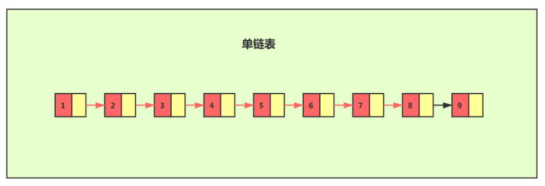
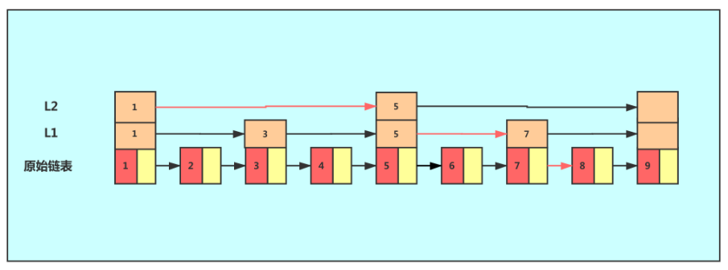
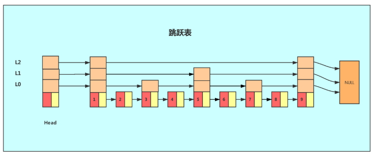
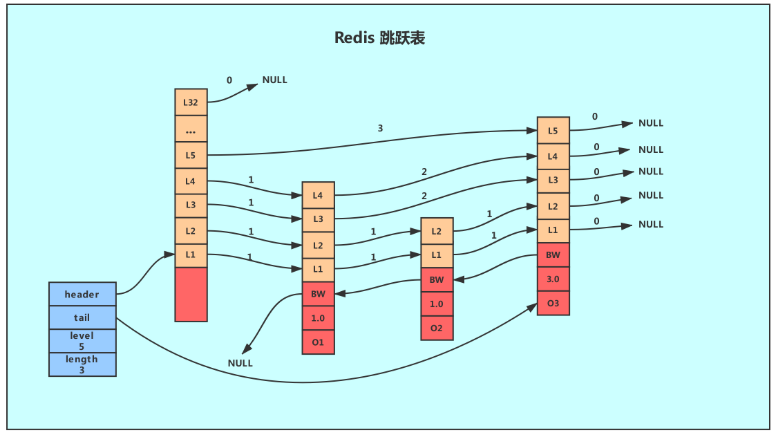
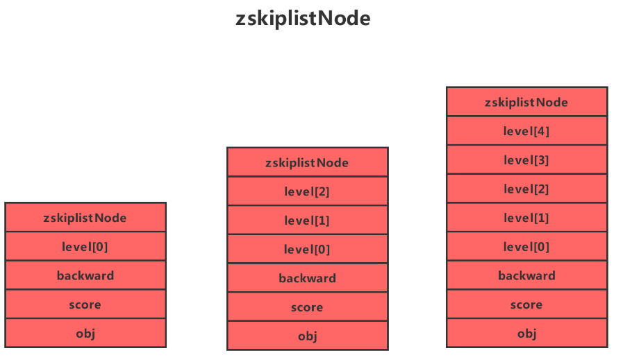

# Redis中的跳跃表

## 前言

跳跃表是一种有序的数据结构，它通过在每个节点维持多个指向其他节点的指针，从而达到快速访问节点的目的。

## 什么是跳跃表

对于单个链表来讲，即便链表中存储的数据是有序的，如果我们要向在其中查找某个数据，它只能从头到尾遍历链表。这样查找效率就会很低，时间复杂度会很高，达到了O(n)。

如果我们想要提高其查询效率，可以考虑在链表上构建索引的 方式，每两个节点提取一个节点到上级，我们把抽出来的那一级就叫做索引。

这个时候，我们假设要查找节点8，我们可以心在索引层遍历，当遍历到索引层中值为7的节点时，发现下一个节点是9，那么要查找的节点肯定在这两个节点之间，我们下降到链表层继续遍历就找到了8这个节点。。原来我们在单链表中找到8这个节点要遍历8个节点，而现在有了一级索引后，只需要遍历5个节点。

从额个例子中，我们可以看出，加来一层索引后，查找一个节点需要遍历的节点个数减少了，也就是说查询效率得到了提升，同理我们在一级索引的基础上，在加二级索引。

从图中我们可以看出，查找效率又有了提升，因为在这里例子中我们的数据量很少，当有大量的数据时，我们可以增加多级索引，去查汇总啊效率可以得到明显的提升。

像这种链表增加多种索引的结构，就是跳跃表。

## Redis中的跳跃表

从上面跳跃表的定义我们可以知道，如果使用跳跃表作为底层的数据结构，那么需要保证 元素之间的**有序性**，而且sortSet我们知道，他就是一个元素和元素之间排序好。

Redis中使用跳跃表作为有序集合键的底层实现之一，以下几种情况将会让Redis使用跳跃表作为有序集合键的底层实现

- 一个有序集合包含的元素数量比较多
- 有序集合中元素的成员键比较长

跳跃表支持平均O(logN)、最坏O(N) 复杂度的节点查找，还可以通过顺序性操作来批量处理节点。在大部分情况下，跳跃表的效率可以和平衡树相媲美，并且因为跳跃表的实现比平衡树要来得更为简单，所以有不少程序都使用跳跃表来代替平衡树。

**那么为什么元素数量比较多或者比较长的字符串的时候，Redis要使用跳跃表来实现呢？**

从上面我们知道，跳跃表就是在链表的基础上，增加了多级索引以提升查找的效率，其实就是一个空间换时间的方法，必然会带来一个问题 -- 索引是占内存的。

原始链表中存储的有可能是很大的对象，而索引节点只需要存储键值和几个指针，并不需要存储对象，因此当节点本身比较大或者元素数量比较多的时候，其优势必然会被放大，而缺点几乎可以忽略。

## Redis中跳跃表的实现

Redis的跳跃表由zSkipListNode和skipList两个结构定义，其中zSkipListNode结构用于表示跳跃表节点，而zSkipList结构则用于保存跳跃表节点的相关信息，比如节点的数量，以及指向表头节点和表尾节点的指针等等。

上图展示了一个跳跃表的实例，其中最左边的是skipList结构，该结构包含以下属性

- header：指向跳跃表的表头节点，通过这个指针程序定位表头节点的时间复杂度就为O(1)
- tail：指向跳跃表的表尾节点,通过这个指针程序定位表尾节点的时间复杂度就为O(1)
- level：记录目前跳跃表内,层数最大的那个节点的层数(表头节点的层数不计算在内)，通过这个属性可以再O(1)的时间复杂度内获取层高最好的节点的层数。
- length：记录跳跃表的长度,也即是,跳跃表目前包含节点的数量(表头节点不计算在内)，通过这个属性，程序可以再O(1)的时间复杂度内返回跳跃表的长度。

结构右方的是四个 zskiplistNode结构,该结构包含以下属性

- 层

节点中用L1、L2、L3等字样标记节点的各个层,L1代表第一层,L代表第二层,以此类推。

每个层都带有两个属性:前进指针和跨度。前进指针用于访问位于表尾方向的其他节点,而跨度则记录了前进指针所指向节点和当前节点的距离(跨度越大、距离越远)。在上图中,连线上带有数字的箭头就代表前进指针,而那个数字就是跨度。当程序从表头向表尾进行遍历时,访问会沿着层的前进指针进行。

  每次创建一个新跳跃表节点的时候,程序都根据幂次定律(powerlaw）,越大的数出现的概率越小)随机生成一个介于1和32之间的值作为level数组的大小,这个大小就是层的“高度”。

- 后退(backward)指针

节点中用BW字样标记节点的后退指针,它指向位于当前节点的前一个节点。后退指针在程序从表尾向表头遍历时使用。与前进指针所不同的是每个节点只有一个后退指针，因此每次只能后退一个节点。

- 分值(score)

各个节点中的1.0、2.0和3.0是节点所保存的分值。在跳跃表中,节点按各自所保存的分值从小到大排列。

- 成员对象(oj)

各个节点中的o1、o2和o3是节点所保存的成员对象。在同一个跳跃表中,各个节点保存的成员对象必须是唯一的,但是多个节点保存的分值却可以是相同的:分值相同的节点将按照成员对象在字典序中的大小来进行排序,成员对象较小的节点会排在前面(靠近表头的方向),而成员对象较大的节点则会排在后面(靠近表尾的方向)。

## 本文重点

- 跳跃表基于单链表加索引的方式实现
- 跳跃表以空间换时间的方式提升了查找速度
- Redis有序集合在节点元素较大或者元素数量较多时使用跳跃表实现
- Redis的跳跃表实现由 zskiplist和 zskiplistnode两个结构组成,其中 zskiplist用于保存跳跃表信息(比如表头节点、表尾节点、长度),而zskiplistnode则用于表示跳跃表节点
- Redis每个跳跃表节点的层高都是1至32之间的随机数
- 在同一个跳跃表中,多个节点可以包含相同的分值,但每个节点的成员对象必须是唯一的，跳跃表中的节点按照分值大小进行排序,当分值相同时,节点按照成员对象的大小进行排序。

## 来源

https://www.cnblogs.com/hunternet/p/11248192.html