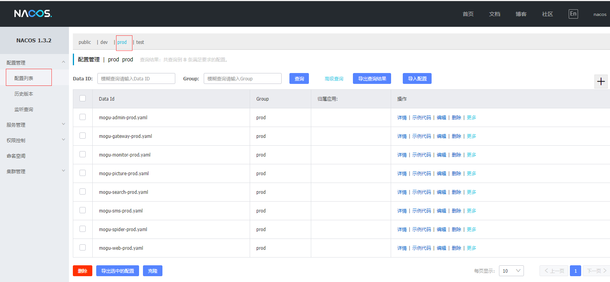
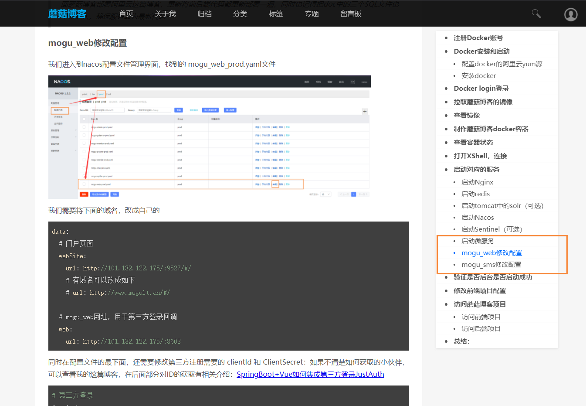
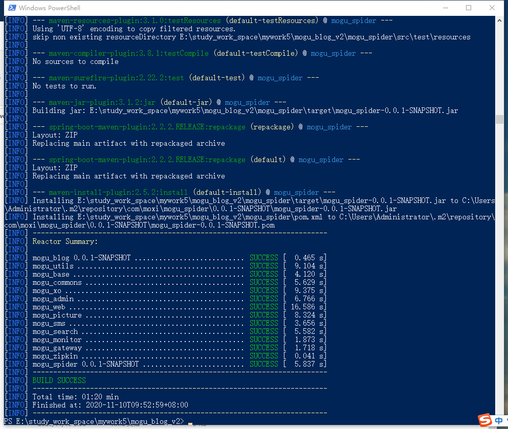
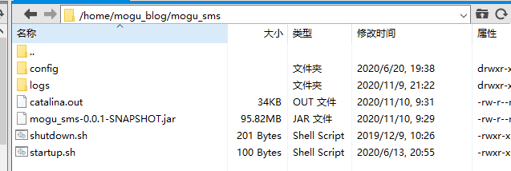
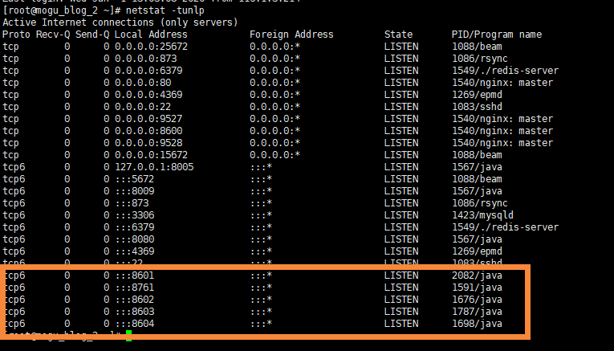
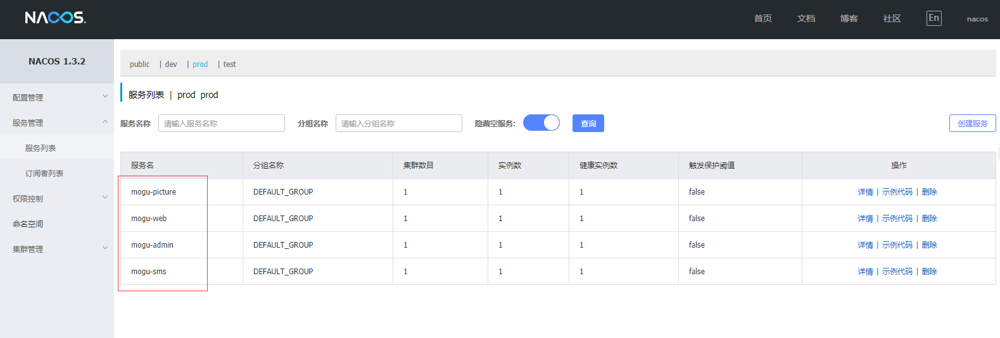
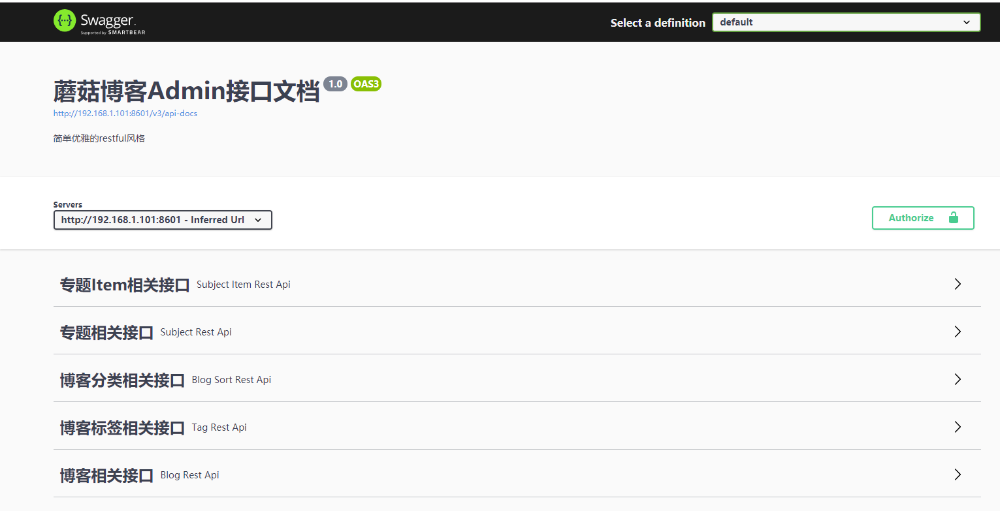
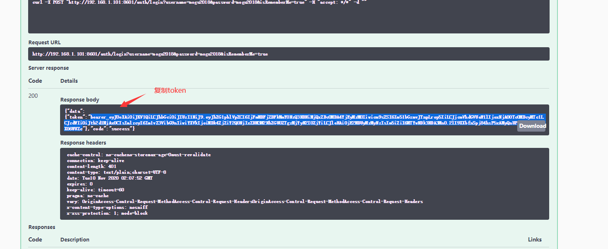
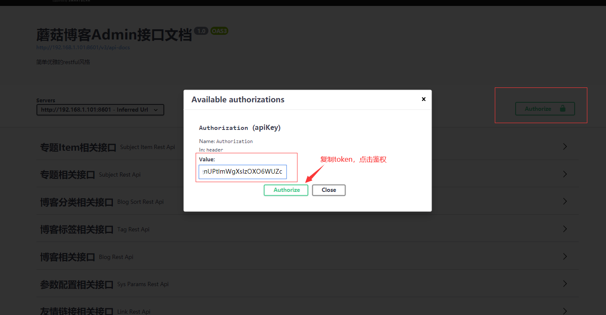
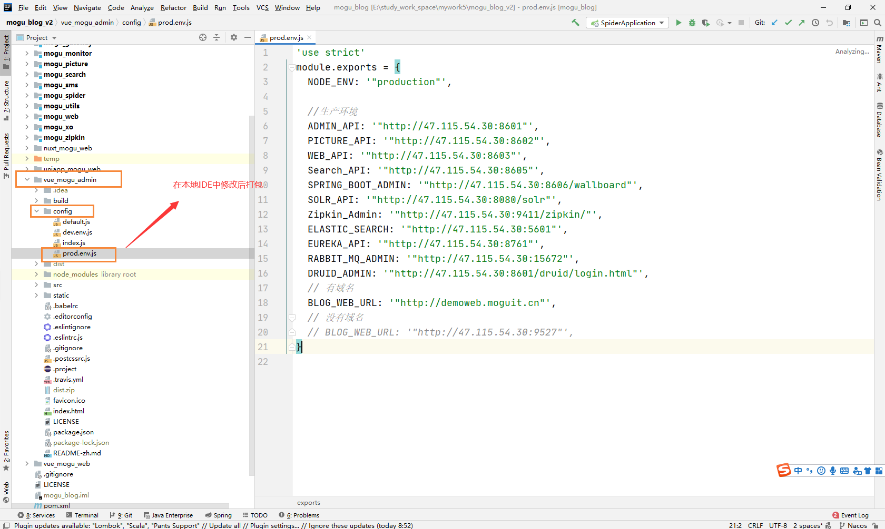

# 蘑菇博客部署到阿里云服务器（Nacos版）

## 前言

最近很多小伙伴问我如何把蘑菇博客部署在自己的云服务器中，今天花费了一些时间整理一下博客部署的过程，希望能够对大家有所帮助，好了话不多说，下面开始进入正式的部署过程。

如果小伙伴还没有安装好对应的环境话，需要按这篇博客搭建好环境：[使用Docker快速搭建蘑菇博客(Nacos版)](http://moguit.cn/#/info?blogUid=8100dcb585fff77e3fa25eed50e3708e)

本文不再重复叙述 nacos、nginx、rabbitmq、mysql、solr以及redis的安装和启动，如果了解，请移步至上一篇博客~

## 更改Nacos配置

首先我们需要确保Nacos成功启动，然后访问Nacos管理页面

```bash
http://your_ip:8848/nacos
```

输入账号密码：nacos   nacos

打开后，选中我们的配置列表， prod环境



然后我们就开始修改我们的一些配置信息了，关于修改哪些配置，这里不再重复，参考这篇博客

 [使用Docker快速搭建蘑菇博客（Nacos分支）](http://moguit.cn/#/info?blogUid=8100dcb585fff77e3fa25eed50e3708e)

然后找到这一节的内容进行修改



## SpringBoot项目打包

首先我们需要将项目拉取下来，然后进入到mogu_blog_v2目录

首先判断当前分支是否是Nacos分支，使用下面命令查看

```bash
git branch
```

这里显示的是目前在Nacos分支，那我们就无需切换


如果不在Nacos分支，使用下面命令切换分支

```bash
# 切换Nacos分支
git checkout Nacos
```

切换好分支后，我们就可以进行 maven依赖安装了

```bash
# 拉取项目
git clone https://gitee.com/moxi159753/mogu_blog_v2.git
# 进入mogu_blog_v2目录
cd mogu_blog_v2
# 执行mvn打包命令
mvn clean install
```

完成上面操作后，能看到下面的图，说明已经成功打包了



下面我们需要进入下列的目录，把对应的 jar上传到我们之前制作的docker容器中

```
# 进入 mogu_sms目录
cd mogu_sms\target
```

我们把下面的jar包复制我服务器中


然后通过xftp工具，把jar复制到Docker容器的/home/mogu_blog/mogu_sms目录，替换里面的jar包

```bash
cd /home/mogu_blog/mogu_sms
```



里面的结构有：

```
./startup.sh  #启动脚本
./shutdown.sh #关闭脚本
mogu_sms***.jar #springboot打包的可执行jar包
/config #外部配置文件
catalina.out #启动脚本后，生成的日志文件
```

然后我们执行里面的start.sh脚本启动jar包

```
./startup.sh
```

startup.sh脚本其实比较简单，代码如下

```
#!/bin/bash     
nohup java  -Xms256m -Xmx512m -jar  mogu_eureka-0.0.1-SNAPSHOT.jar  > catalina.out  2>&1 &
tail -f ./catalina.out
```

就是通过nohup命令，进行后台启动 java jar包，同时里面-Xms256m -Xmx512m 是指定最大堆和最小堆内存，这个命令就是为了防止tomcat请求太多内存，而造成其它项目无法启动。

shutdown.sh脚本如下所示：

```
#!/bin/bash
PID=$(ps -ef | grep mogu_eureka-0.0.1-SNAPSHOT.jar  | grep -v grep | awk '{ print $2 }')
if [ -z "$PID" ]
then
    echo Application is already stopped
else
    echo kill $PID
    kill $PID
fi
```

大概意思就是，我们找到jar启动的PID，然后使用kill命令杀死即可。

启动mogu_sms后，我们重复上面的操作，分别把 mogu_picture、mogu_web、mogu_admin分别执行上述操作，即可完成蘑菇博客后台项目的部署

需要注意的是：mogu_picture项目和mogu_web项目，除了替换对应的jar包外，我们还需要修改对应的配置文件，然后在启动项目【在最开始已经提到】

### 查看项目启动

在我们把配置文件修改完成后，然后启动5个服务后，我们使用下列命令查看启动的端口号

```
netstat -tunlp
```

能够发现5个服务已经成功启动了



到目前为止已经启动了对应的端口了

tip：有些小伙伴反馈rabbitmq端口经常断开，所以在启动项目的时候，注意查看是否出现rabbitmq的报错信息，如果有的话，那就是因为rabbitmq没有正确启动而造成的，使用下面的命令启动即可

```bash
# 启动rabbitmq
systemctl start rabbitmq-server
```

### 查看Nacos注册中心

服务器都启动完成后，下面我们验证一下后台是否正常启动，访问下列的地址：

```
http://your_ip:8848/nacos
```

如果出现下面的页面，说明已经成功启动



### 查看swagger-ui页面

后台项目启动后，都能够看到对应的swagger-ui页面

```
# admin接口
http://your_ip:8601/swagger-ui/index.html
# picture接口
http://your_ip:8602/swagger-ui/index.html
# web接口
http://your_ip:8603/swagger-ui/index.html
```

进入 admin接口是这样的



选择LoginRestApi，验证登录，输入默认用户名和密码：admin  mogu2018，同时选择记住账号密码  true


登录成功后，复制我们的token



然后在swagger页面的右上角，有一个authorize的按钮，点击后，将token粘贴进去，然后所有接口都可测试~



## Vue项目打包

前端部分，我们现在需要修改两个地方的配置，分别是：vue_mogu_admin 和 vue_mogu_web 【在本地修改】



### vue_mogu_web项目打包

下面我们到 vue_mogu_web/config/目录下，修改prod.env.js文件

```
// 如果没有域名使用这个
//VUE_MOGU_WEB: '"http://47.115.54.30:8602"',
// 如果有域名使用这个
VUE_MOGU_WEB: '"http://demoweb.moguit.cn"',
PICTURE_API: '"http://47.115.54.30:8602"',
WEB_API: '"http://47.115.54.30:8603"',
ELASTICSEARCH: '"http://47.115.54.30:8605"',
```

然后执行下列命令，进行依赖安装和打包

```
# 安装依赖
npm install --registry=https://registry.npm.taobao.org

# 打包
npm run build
```

打包完成后，会生成一个dist目录，我们将整个dist目录，压缩成 zip格式


然后使用xftp工具，丢入到我们的前端目录下，目录在 /home/mogu_blog/vue_mogu_web


注意：如果该文件夹下存在 dist文件夹，我们需要将其删除，然后在解压，然后使用下面命令进行解压

```
unzip dist.zip
```

### vue_mogu_admin项目打包

前台admin项目，修改配置的方式基本类似，我们到 vue_mogu_admin/config/目录下，修改prod.env.js文件，然后把里面的ip地址，改成你对应服务器的即可

```
//生产环境
ADMIN_API: '"http://47.115.54.30:8601"',
PICTURE_API: '"http://47.115.54.30:8602"',
WEB_API: '"http://47.115.54.30:8603"',
Search_API: '"http://47.115.54.30:8605"',
SPRING_BOOT_ADMIN: '"http://47.115.54.30:8606/wallboard"',
SOLR_API: '"http://47.115.54.30:8080/solr"',
Zipkin_Admin: '"http://47.115.54.30:9411/zipkin/"',
ELASTIC_SEARCH: '"http://47.115.54.30:5601"',
EUREKA_API: '"http://47.115.54.30:8761"',
RABBIT_MQ_ADMIN: '"http://47.115.54.30:15672"',
DRUID_ADMIN: '"http://47.115.54.30:8601/druid/login.html"',
// 有域名
BLOG_WEB_URL: '"http://demoweb.moguit.cn"',
// 没有域名
// BLOG_WEB_URL: '"http://47.115.54.30:9527"',
```

修改完成后，需要进行重新编译~ 打包~ 部署

```
# 安装依赖
npm install --registry=https://registry.npm.taobao.org

# 打包
npm run build
```

我们在按上述操作，把dist压缩，然后放到/home/mogu_blog/vue_mogu_admin文件夹下


然后解压

```
unzip dist.zip
```

## 访问前端项目

执行完上述操作后，即可重新访问页面了

```
# 前台项目
http://yourIp:9527
# 后台项目 admin  mogu2018
http://yourIp:9528
```

如果配置了域名的话，输入对应的域名即可

```yaml
# 前台项目
http://www.moguit.cn
# 后台项目 admin  mogu2018
http://admin.moguit.cn
```

