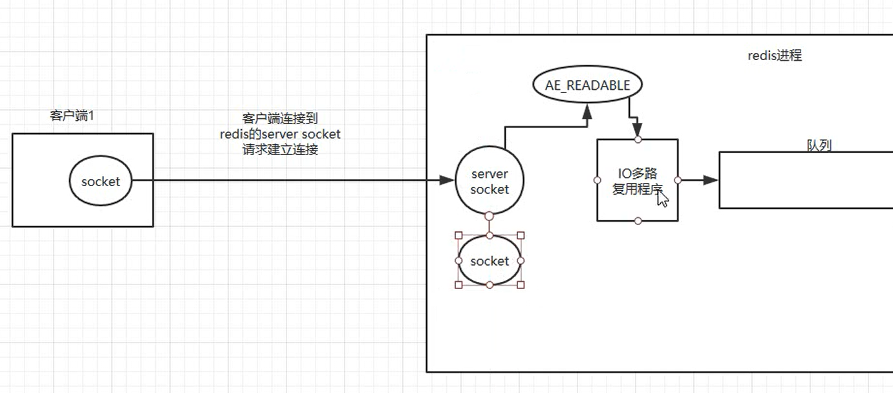
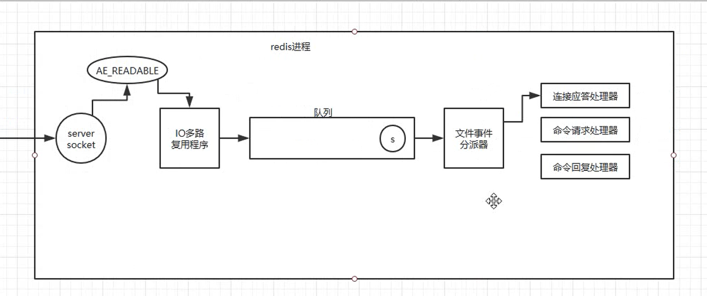

# Redis的面试连环炮

## 面试题

- Redis和Memcache有什么区别
- Redis的线程模型是什么？
- Redis的数据类型及应用场景？
- 为什么单线程的Redis比多线程的Memcache的效率要高？
- 为什么Redis是单线程但是还可以支撑高并发？
- 如何保证Redis的高并发和高可用？
- redis的主从复制原理能介绍一下么？
- redis的哨兵原理能介绍一下么？

## 剖析

Redis最基本的一个内部原理和特点就是NIO异步的单线程工作模型。Memcache是早些年个大互联网公司常用的缓存方案，但是现在近几年都是使用的redis，没有什么公司使用Memcache了。

## Redis和Memcache的区别

从Redis作者给出的几个比较

- Redis拥有更多的数据结构
  - Redis相比Memcache来说，拥有更多的数据结构和支持更丰富的数据操作，通常在Memcache里，你需要将数据拿到客户端来进行类似的修改，在set进去。这就大大增加了网络IO的次数和体积，在Redis中，这些复杂的操作通常和一般的set/get一样高效。所以，如果需要缓存能够支持更复杂的结构和操作，那么Redis是不错的选择
- Redis内存利用率对比
  - 使用简单的key-value存储的话，Memcache的内存利用率更高，而Redis采用Hash结构来做key-value存储，由于其组合式的压缩，其内存利用率会高于Memcache
- 性能对比
  - 由于Redis只使用了单核，而Memcache可以使用多核，所以平均每核上Redis在存储小数据比Memcache性能更高，而在100K以上的数据中，Memcache性能更高，虽然Redis最近也在存储大数据的性能上进行优化，但是比起Memcache还有略有逊色。
- 集群模式
  - Memcache没有原生的集群模式，需要依赖客户端来实现往集群中分片写入数据，但是Redis目前是原生支持cluster模式的。


## Redis都有哪些数据类型，及使用场景

- String

  - 最基本的类型，就和普通的set 和 get，做简单的key - value 存储

- Hash

  - 这个是 类似于Map的一种结构，就是一半可以将结构化数据，比如对象（前提是这个对象没有嵌套其它对象）给缓存在redis中，每次读写redis缓存的时候，可以操作hash里面的某个字段

  ```
  key=150
  value={
    "id": 150,
    "name": "张三",
    "age": 20,  
  }
  ```

  - Hash类的数据结构，主要用来存放一些对象，把一些简单的对象给缓存起来，后续操作的时候，你可以直接仅仅修改这个对象中某个字段的值。

- List

  - 有序列表，可以通过list存储一些列表型的数据结构，类似粉丝列表，文章的评论列表之类的东西。
  - 可以通过lrange命令，从某个元素开始读取多少个元素，可以基于list实现分页查询，基于Redis实现简单的高性能分页，可以做类似微博那种下拉不断分页的东西，性能高，就是一页一页走。
  - 可以制作一个简单的消息队列，从list头插入，从list 的尾巴取出

- Set

  - 无序列表，自动去重
  - 直接基于Set将系统中需要去重的数据丢进去，如果你需要对一些数据进行快速的全局去重，就可以使用基于JVM内存里的HashSet进行去重，但是如果你的某个系统部署在多台机器上的话，只有使用Redis进行全局的Set去重
  - 可以基于set玩儿交集、并集、差集的操作，比如交集吧，可以把两个人的粉丝列表整一个交集，看看俩人的共同好友是谁？把两个大v的粉丝都放在两个set中，对两个set做交集

- Sort Set

  - 排序的set，去重但是可以排序，写进去的时候给一个分数，自动根据分数排序，这个可以玩儿很多的花样，最大的特点是有个分数可以自定义排序规则

  - 比如说你要是想根据时间对数据排序，那么可以写入进去的时候用某个时间作为分数，人家自动给你按照时间排序了

  - 排行榜：将每个用户以及其对应的什么分数写入进去，zadd board score username，接着zrevrange board 0 99，就可以获取排名前100的用户；zrank board username，可以看到用户在排行榜里的排名

```
zadd board 85 zhangsan
zadd board 72 wangwu
zadd board 96 lisi
zadd board 62 zhaoliu

96 lisi
85 zhangsan
72 wangwu
62 zhaoliu

zrevrange board 0 3

获取排名前3的用户

96 lisi
85 zhangsan
72 wangwu

zrank board zhaoliu

```


## Redis的线程模型

### 文件事件处理器

Redis基于reactor模式开发了网络事件处理器，这个处理器叫做文件事件处理器，file event handler，这个文件事件处理器是单线程的，因此Redis才叫做单线程的模型，采用IO多路复用机制同时监听多个socket，根据socket上的事件来选择相应的事件处理器来处理这个事件。

文件事件处理器是单线程模式下运行的，但是通过IO多路复用机制监听了多个socket，可以实现高性能的网络通信模型，又可以跟内部的其它单线程的模块进行对接，保证了Redis内部的线程模型的简单性。

文件事件处理器的结构包含4个部分：多个socket，IO多路复用程序，文件事件分派器，事件处理器等。

多个socket可能并发的产生不同的操作，每个操作对应不同的文件事件，但是IO多路复用程序会监听多个socket，但是会把socket放入到一个队列中排队，每次从队列中取出一个socket给事件分派器，事件分派器把socket给对应的时间处理器。





每次我们一个socket请求过来 和 redis中的 server socket建立连接后，通过IO多路复用程序，就会往队列中插入一个socket，文件事件分派器就是将队列中的socket取出来，分派到对应的处理器，在处理器处理完成后，才会从队列中在取出一个。

这里也就是用一个线程，监听了客户端的所有请求，被称为Redis的单线程模型。


## 为什么Redis单线程模型效率这么高？

- 纯内存操作
- 核心是非阻塞的IO多路复用机制
- 单线程反而避免了多线程频繁上下文切换的问题


## Redis的过期策略

### Redis中的数据为什么会丢失

之前有同学问过我，说我们生产环境的redis怎么经常会丢掉一些数据？写进去了，过一会儿可能就没了。我的天，同学，你问这个问题就说明redis你就没用对啊。redis是缓存，你给当存储了是吧？

啥叫缓存？用内存当缓存。内存是无限的吗，内存是很宝贵而且是有限的，磁盘是廉价而且是大量的。可能一台机器就几十个G的内存，但是可以有几个T的硬盘空间。redis主要是基于内存来进行高性能、高并发的读写操作的。

那既然内存是有限的，比如redis就只能用10个G，你要是往里面写了20个G的数据，会咋办？当然会干掉10个G的数据，然后就保留10个G的数据了。那干掉哪些数据？保留哪些数据？当然是干掉不常用的数据，保留常用的数据了。所以说，这是缓存的一个最基本的概念，数据是会过期的，要么是你自己设置个过期时间，要么是redis自己给干掉。

```
set key value 过期时间（1小时）
set进去的key，1小时之后就没了，就失效了
```

### 数据明明都过期了，怎么还占用着内存啊？

还有一种就是如果你设置好了一个过期时间，你知道redis是怎么给你弄成过期的吗？什么时候删除掉？如果你不知道，之前有个学员就问了，为啥好多数据明明应该过期了，结果发现redis内存占用还是很高？那是因为你不知道redis是怎么删除那些过期key的。

redis 内存一共是10g，你现在往里面写了5g的数据，结果这些数据明明你都设置了过期时间，要求这些数据1小时之后都会过期，结果1小时之后，你回来一看，redis机器，怎么内存占用还是50%呢？5g数据过期了，我从redis里查，是查不到了，结果过期的数据还占用着redis的内存。

### 定期删除和惰性删除

我们Redis设置了过期时间，其实内部是 定期删除 + 惰性删除两个再起作用的。

所谓定期删除，指的是redis默认是每隔100ms就随机抽取一些设置了过期时间的key，检查其是否过期，如果过期就删除。假设redis里放了10万个key，都设置了过期时间，你每隔几百毫秒，就检查10万个key，那redis基本上就死了，cpu负载会很高的，消耗在你的检查过期key上了。注意，这里可不是每隔100ms就遍历所有的设置过期时间的key，那样就是一场性能上的灾难。实际上redis是每隔100ms随机抽取一些key来检查和删除的。

但是问题是，定期删除可能会导致很多过期key到了时间并没有被删除掉，那咋整呢？所以就是惰性删除了。这就是说，在你获取某个key的时候，redis会检查一下 ，这个key如果设置了过期时间那么是否过期了？如果过期了此时就会删除，不会给你返回任何东西。

并不是key到时间就被删除掉，而是你查询这个key的时候，redis再懒惰的检查一下

通过上述两种手段结合起来，保证过期的key一定会被干掉。

很简单，就是说，你的过期key，靠定期删除没有被删除掉，还停留在内存里，占用着你的内存呢，除非你的系统去查一下那个key，才会被redis给删除掉。

但是实际上这还是有问题的，如果定期删除漏掉了很多过期key，然后你也没及时去查，也就没走惰性删除，此时会怎么样？如果大量过期key堆积在内存里，导致redis内存块耗尽了，咋整？

答案是：走内存淘汰机制。

### Redis内存淘汰机制

如果redis的内存占用过多的时候，此时会进行内存淘汰，有如下一些策略：

```
redis 10个key，现在已经满了，redis需要删除掉5个key

1个key，最近1分钟被查询了100次

1个key，最近10分钟被查询了50次

1个key，最近1个小时倍查询了1次
```

1）noeviction：当内存不足以容纳新写入数据时，新写入操作会报错，这个一般没人用吧，实在是太恶心了

2）allkeys-lru：当内存不足以容纳新写入数据时，在键空间中，移除最近最少使用的key（这个是最常用的）

3）allkeys-random：当内存不足以容纳新写入数据时，在键空间中，随机移除某个key，这个一般没人用吧，为啥要随机，肯定是把最近最少使用的key给干掉啊

4）volatile-lru：当内存不足以容纳新写入数据时，在设置了过期时间的键空间中，移除最近最少使用的key（这个一般不太合适）

5）volatile-random：当内存不足以容纳新写入数据时，在设置了过期时间的键空间中，随机移除某个key

6）volatile-ttl：当内存不足以容纳新写入数据时，在设置了过期时间的键空间中，有更早过期时间的key优先移除

很简单，你写的数据太多，内存满了，或者触发了什么条件，redis lru，自动给你清理掉了一些最近很少使用的数据

## Redis中的LRU算法

Java版本的LRU

```
public class LRUCache<K, V> extends LinkedHashMap<K, V> {
    
private final int CACHE_SIZE;

    // 这里就是传递进来最多能缓存多少数据
    public LRUCache(int cacheSize) {
        super((int) Math.ceil(cacheSize / 0.75) + 1, 0.75f, true); // 这块就是设置一个hashmap的初始大小，同时最后一个true指的是让linkedhashmap按照访问顺序来进行排序，最近访问的放在头，最老访问的就在尾
        CACHE_SIZE = cacheSize;
    }

    @Override
    protected boolean removeEldestEntry(Map.Entry eldest) {
        return size() > CACHE_SIZE; // 这个意思就是说当map中的数据量大于指定的缓存个数的时候，就自动删除最老的数据
    }

```


## 如何保证Redis的高并发及高可用？

如何保证Redis的高并发和高可用？

redis的主从复制原理能介绍一下么？

redis的哨兵原理能介绍一下么？

### 剖析

就是如果你用redis缓存技术的话，肯定要考虑如何用redis来加多台机器，保证redis是高并发的，还有就是如何让Redis保证自己不是挂掉以后就直接死掉了，redis高可用

我这里会选用我之前讲解过这一块内容，redis高并发、高可用、缓存一致性

redis高并发：主从架构，一主多从，一般来说，很多项目其实就足够了，单主用来写入数据，单机几万QPS，多从用来查询数据，多个从实例可以提供每秒10万的QPS。

redis高并发的同时，还需要容纳大量的数据：一主多从，每个实例都容纳了完整的数据，比如redis主就10G的内存量，其实你就最对只能容纳10g的数据量。如果你的缓存要容纳的数据量很大，达到了几十g，甚至几百g，或者是几t，那你就需要redis集群，而且用redis集群之后，可以提供可能每秒几十万的读写并发。

redis高可用：如果你做主从架构部署，其实就是加上哨兵就可以了，就可以实现，任何一个实例宕机，自动会进行主备切换。

##  Redis如何通过读写分离来承受百万的QPS

### redis高并发跟整个系统的高并发之间的关系

redis，你要搞高并发的话，不可避免，要把底层的缓存搞得很好

mysql，高并发，做到了，那么也是通过一系列复杂的分库分表，订单系统，事务要求的，QPS到几万，比较高了

要做一些电商的商品详情页，真正的超高并发，QPS上十万，甚至是百万，一秒钟百万的请求量

光是redis是不够的，但是redis是整个大型的缓存架构中，支撑高并发的架构里面，非常重要的一个环节

首先，你的底层的缓存中间件，缓存系统，必须能够支撑的起我们说的那种高并发，其次，再经过良好的整体的缓存架构的设计（多级缓存架构、热点缓存），支撑真正的上十万，甚至上百万的高并发

### redis不能支撑高并发的瓶颈在哪里？

因为单机的Redis，QPS只能在上万左右，成为了支撑高并发的瓶颈。

### 如果redis要支撑超过10万+的并发，那应该怎么做？

单机的redis几乎不太可能说QPS超过10万+，除非一些特殊情况，比如你的机器性能特别好，配置特别高，物理机，维护做的特别好，而且你的整体的操作不是太复杂，单机在几万。

读写分离，一般来说，对缓存，一般都是用来支撑读高并发的，写的请求是比较少的，可能写请求也就一秒钟几千，一两千。大量的请求都是读，一秒钟二十万次读

读写分离：主从架构 -> 读写分离 -> 支撑10万+读QPS的架构


架构做成主从架构，一主多从，主服务器负责写，并且将数据同步到其它的slave节点，从节点负责读，所有的读请求全部走节点。

同时这样的架构，支持碎片扩容，就是说如果QPS在增加，也很简单，只需要增加  Redis Slave节点即可。

### redis replication

redis主从架构 -> 读写分离架构 -> 可支持水平扩展的读高并发架构