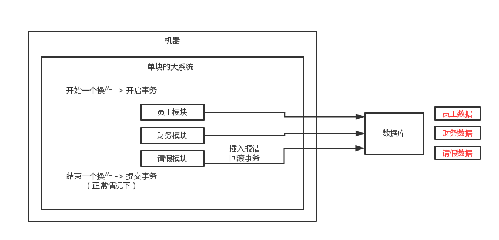
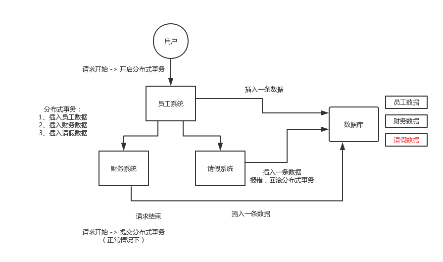

# 分布式事务解决方案

- 分布式事务了解吗
- 你如何解决分布式事务问题

## 剖析

只要聊到你做了分布式系统，必问分布式事务，你对分布式事务一无所知的话，确实会很坑，你起码得知道有哪些方案，一般怎么来做，每个方案的优缺点是什么。

现在面试，分布式系统成了标配，而分布式系统带来的分布式事务也成了标配了。因为你做系统肯定要用事务吧，那你用事务的话，分布式系统之后肯定要用分布式事务吧。先不说你搞过没有，起码你得明白有哪几种方案，每种方案可能有啥坑？比如TCC方案的网络问题、XA方案的一致性问题

### 单机系统下的事务

### 分布式系统下的事务

## 两阶段提交方案/XA方案

 也叫做两阶段提交事务方案，这个举个例子，比如说咱们公司里经常tb是吧（就是团建），然后一般会有个tb主席（就是负责组织团建的那个人）。

tb，team building，团建

第一个阶段，一般tb主席会提前一周问一下团队里的每个人，说，大家伙，下周六我们去滑雪+烧烤，去吗？这个时候tb主席开始等待每个人的回答，如果所有人都说ok，那么就可以决定一起去这次tb。如果这个阶段里，任何一个人回答说，我有事不去了，那么tb主席就会取消这次活动。

第二个阶段，那下周六大家就一起去滑雪+烧烤了

所以这个就是所谓的XA事务，两阶段提交，有一个事务管理器的概念，负责协调多个数据库（资源管理器）的事务，事务管理器先问问各个数据库你准备好了吗？如果每个数据库都回复ok，那么就正式提交事务，在各个数据库上执行操作；如果任何一个数据库回答不ok，那么就回滚事务。

这种分布式事务方案，比较适合单块应用里，跨多个库的分布式事务，而且因为严重依赖于数据库层面来搞定复杂的事务，效率很低，绝对不适合高并发的场景。如果要玩儿，那么基于spring + JTA就可以搞定，自己随便搜个demo看看就知道了。

这个方案，我们很少用，一般来说某个系统内部如果出现跨多个库的这么一个操作，是不合规的。我可以给大家介绍一下， 现在微服务，一个大的系统分成几百个服务，几十个服务。一般来说，我们的规定和规范，是要求说每个服务只能操作自己对应的一个数据库。

如果你要操作别的服务对应的库，不允许直连别的服务的库，违反微服务架构的规范，你随便交叉胡乱访问，几百个服务的话，全体乱套，这样的一套服务是没法管理的，没法治理的，经常数据被别人改错，自己的库被别人写挂。

如果你要操作别人的服务的库，你必须是通过调用别的服务的接口来实现，绝对不允许你交叉访问别人的数据库！

## TCC方案

TCC的全程是：Try、Confirm、Cancel。

这个其实是用到了补偿的概念，分为了三个阶段：

1）Try阶段：这个阶段说的是对各个服务的资源做检测以及对资源进行锁定或者预留

2）Confirm阶段：这个阶段说的是在各个服务中执行实际的操作

3）Cancel阶段：如果任何一个服务的业务方法执行出错，那么这里就需要进行补偿，就是执行已经执行成功的业务逻辑的回滚操作

给大家举个例子吧，比如说跨银行转账的时候，要涉及到两个银行的分布式事务，如果用TCC方案来实现，思路是这样的：

1）Try阶段：先把两个银行账户中的资金给它冻结住就不让操作了

2）Confirm阶段：执行实际的转账操作，A银行账户的资金扣减，B银行账户的资金增加

3）Cancel阶段：如果任何一个银行的操作执行失败，那么就需要回滚进行补偿，就是比如A银行账户如果已经扣减了，但是B银行账户资金增加失败了，那么就得把A银行账户资金给加回去

这种方案说实话几乎很少用人使用，我们用的也比较少，但是也有使用的场景。因为这个事务回滚实际上是严重依赖于你自己写代码来回滚和补偿了，会造成补偿代码巨大，非常之恶心。

比如说我们，一般来说跟钱相关的，跟钱打交道的，支付、交易相关的场景，我们会用TCC，严格严格保证分布式事务要么全部成功，要么全部自动回滚，严格保证资金的正确性，在资金上出现问题

比较适合的场景：这个就是除非你是真的一致性要求太高，是你系统中核心之核心的场景，比如常见的就是资金类的场景，那你可以用TCC方案了，自己编写大量的业务逻辑，自己判断一个事务中的各个环节是否ok，不ok就执行补偿/回滚代码。

而且最好是你的各个业务执行的时间都比较短。

但是说实话，一般尽量别这么搞，自己手写回滚逻辑，或者是补偿逻辑，实在太恶心了，那个业务代码很难维护。

 